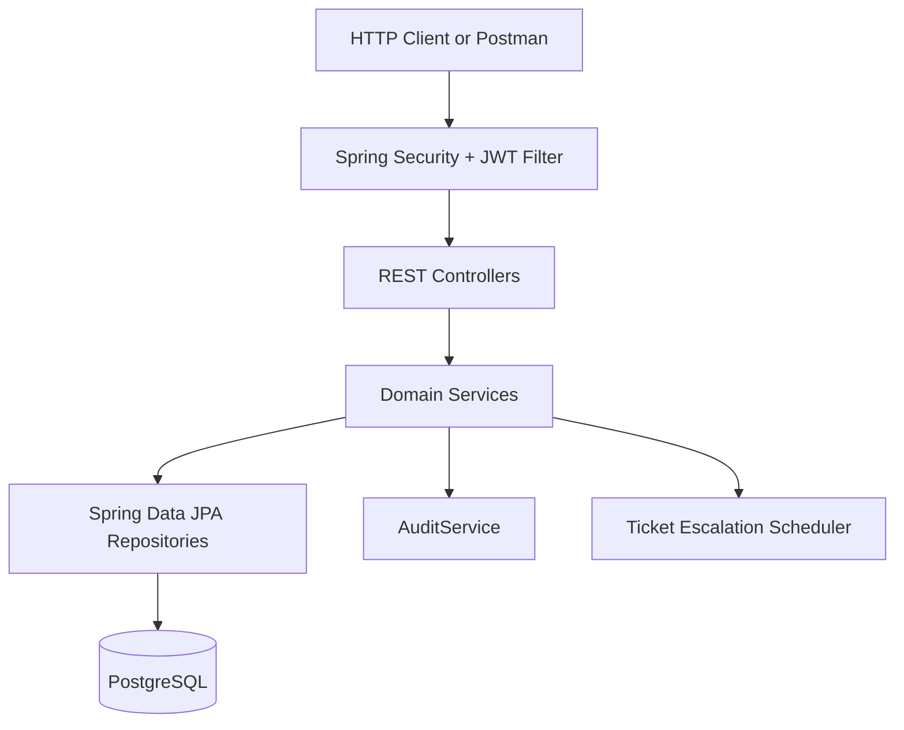
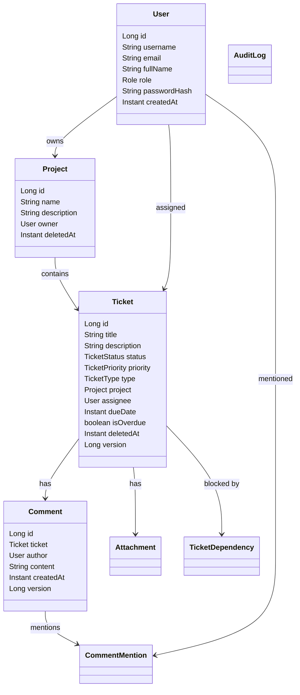
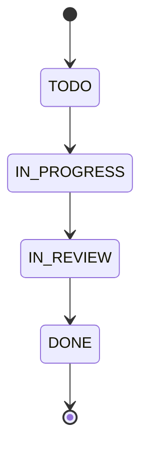

# IssueFlow Design

This document describes the implementation that is currently in the repository.
The README API tables are the public contract, and
`TDP_issueflow_requirements.pdf` is the assignment source.

## Architecture

IssueFlow is a modular Spring Boot monolith. HTTP controllers handle request
mapping and validation, services own business rules, repositories handle JPA
persistence, and DTO records define public API shapes.



Packages:

- `auth`: login, logout, JWT creation/validation, security config, seeded users.
- `users`: user CRUD and public user DTOs.
- `projects`: project CRUD, soft delete/restore, workload.
- `tickets`: ticket CRUD, lifecycle rules, dependencies, CSV, escalation, assignment.
- `comments`: comments and mention parsing/recalculation.
- `attachments`: upload/delete validation and storage.
- `audit`: append-only audit log and query endpoint.
- `common`: shared errors, exceptions, and validation helpers.

## Domain Model



DTOs expose scalar IDs such as `ownerId`, `projectId`, `assigneeId`,
`ticketId`, and `authorId`. JPA entities use object relationships.

## Authentication and Authorization

- `POST /auth/login` is public.
- Every other endpoint requires a Bearer JWT.
- Passwords are stored with BCrypt hashes.
- JWTs are HMAC-SHA256 signed by `JwtService`.
- JWT payload contains `sub`, `userId`, `role`, `iat`, and `exp`.
- `POST /auth/logout` adds the current token to an in-memory deny-list until
  expiration.
- Deleted-list and restore endpoints for projects/tickets are ADMIN only.

Seed data creates:

- `admin` / `issueflow123` / `ADMIN`
- `dev` / `issueflow123` / `DEVELOPER`

The default password and JWT secret can be overridden with
`ISSUEFLOW_DEFAULT_PASSWORD` and `JWT_SECRET`.

## Ticket Lifecycle



Rules implemented in `TicketService`:

- Status can stay the same or advance exactly one step.
- Backward jumps and forward skips are rejected.
- DONE tickets cannot be updated.
- A ticket cannot move to DONE while any non-deleted blocker is not DONE.
- Manual priority updates clear `isOverdue`.
- Empty PATCH requests do not write an audit row.

`Ticket` and `Comment` use `@Version` for optimistic locking. The API does not
expose a version field, so optimistic locking is verified at the persistence
layer in tests.

## Soft Delete

- Projects and tickets use `deletedAt`.
- Normal project and ticket reads hide soft-deleted rows.
- Tickets belonging to a soft-deleted project are treated as hidden.
- CSV export, comments, dependencies, and attachments also reject tickets whose
  project is deleted.
- Ticket restore is rejected while its parent project is deleted.
- Users and comments are hard-deleted because the assignment only requires soft
  delete for projects and tickets.

## Audit Logging

`AuditService` writes append-only audit rows inside the same transaction as the
state-changing operation.

- Manual actions use `actor = USER` and `performedBy = current user`.
- Auto-assignment and auto-escalation use `actor = SYSTEM`.
- The audit endpoint supports filters by `entityType`, `entityId`, `action`,
  and `actor`.

## Auto-Assignment and Workload

There is no project-membership API in the assignment contract. The practical
implementation choice is:

- Auto-assignment candidates are all users with role `DEVELOPER`.
- Assignment happens only when creating a ticket without `assigneeId`.
- Workload is the count of non-DONE, non-deleted tickets assigned to a developer
  in the same project.
- The least-loaded developer wins; ties are broken by oldest `createdAt`, then
  user id.
- If no developers exist, the ticket remains unassigned.
- The workload endpoint returns developers who currently have at least one
  non-deleted ticket in the project, sorted by open ticket count and user id.

## Auto-Escalation

Every 60 seconds, `TicketService.escalateOverdueTickets` scans active unresolved
tickets with `dueDate < now`.

- LOW becomes MEDIUM.
- MEDIUM becomes HIGH.
- HIGH becomes CRITICAL.
- CRITICAL stays CRITICAL and sets `isOverdue = true`.
- Escalation never changes ticket status.
- Each system change is audited as `AUTO_ESCALATE`.

## CSV Import and Export

- Export fields are exactly:
  `id,title,description,status,priority,type,assigneeId`.
- CSV parsing uses Apache Commons CSV, so commas and quotes inside values are
  handled correctly.
- Import accepts multipart `file` and form field `projectId`.
- Each row is validated independently.
- Valid rows are created even if other rows fail.
- Import returns `{ "created": n, "failed": n, "errors": [...] }`.

## Attachments

Attachments are stored in the database as metadata plus binary content.

Allowed content types:

- `image/png`
- `image/jpeg`
- `application/pdf`
- `text/plain`

Maximum size is 10 MB, enforced by Spring multipart configuration and by the
service layer.

## Mentions

Mentions use the pattern `@username`, are matched case-insensitively, and are
stored in `comment_mentions`.

- Unknown mentioned users are rejected.
- Duplicate mentions in the same comment are deduplicated.
- Updating a comment deletes old mention rows and inserts the recalculated set.
- `GET /users/{userId}/mentions` returns newest matching comments first.

## Error Handling

Errors are returned as `ApiError`:

```json
{
  "timestamp": "2026-05-23T10:00:00Z",
  "status": 400,
  "error": "Bad Request",
  "message": "Validation failed",
  "details": ["email: must be a well-formed email address"]
}
```

Expected statuses:

- `400 Bad Request` for validation and business-rule failures.
- `401 Unauthorized` for missing or invalid JWT.
- `403 Forbidden` for authenticated users without ADMIN permission.
- `404 Not Found` for missing or hidden resources.
- `409 Conflict` for optimistic locking conflicts or DONE-ticket immutability.

## Tests

Current test groups:

- Context loading.
- Ticket service lifecycle, dependency, assignment, escalation rules.
- Mention parsing.
- Full API integration for auth, admin-only endpoints, soft delete, audit logs,
  CSV, attachments, mentions, and system audit.
- User-management integration for create/list/get/update/delete, validation,
  duplicate username/email, and password-hash hiding.
- JPA optimistic-locking integration.

See `testing.md` for exact commands and latest results.

## Known Tradeoffs

- No project-membership model exists because the README contract does not define
  one.
- Logout deny-list is in-memory, so it resets on app restart. This is acceptable
  for the assignment scope.
- Attachment download is not implemented because the README only requires upload
  and delete.
- Database migrations are not added; local runtime uses Hibernate `ddl-auto:
  update`, and tests use `create-drop`.
