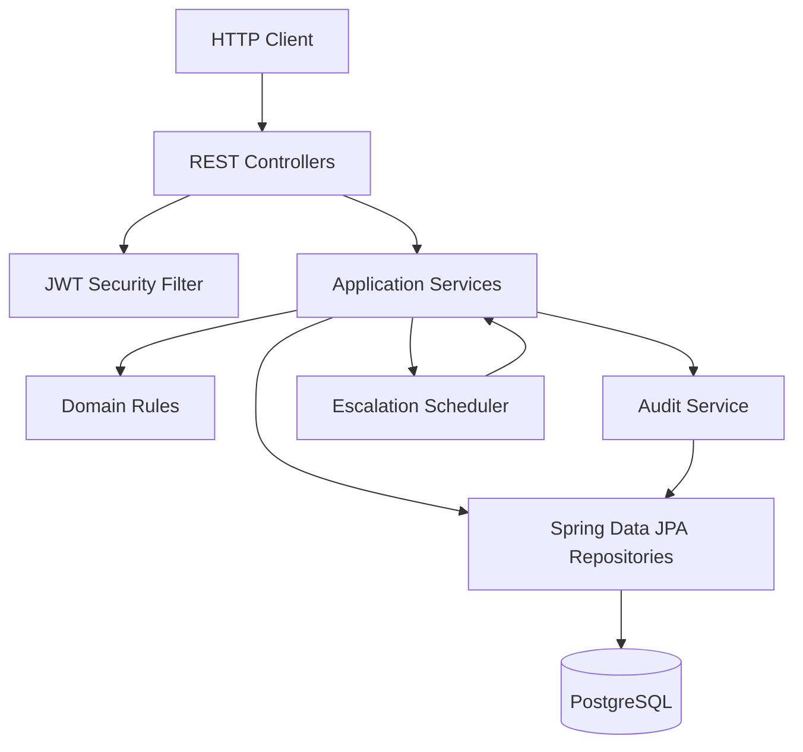
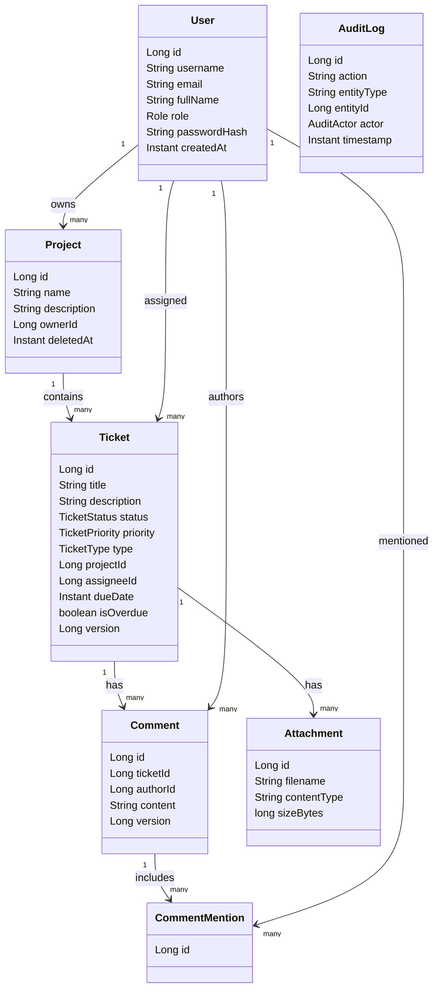
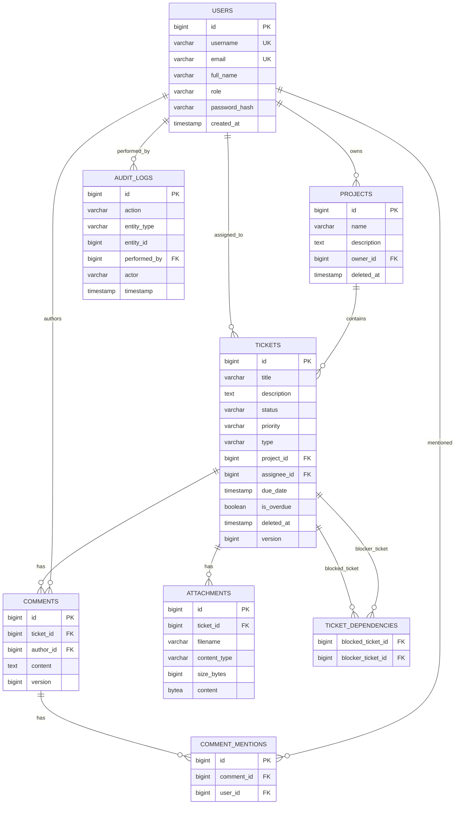
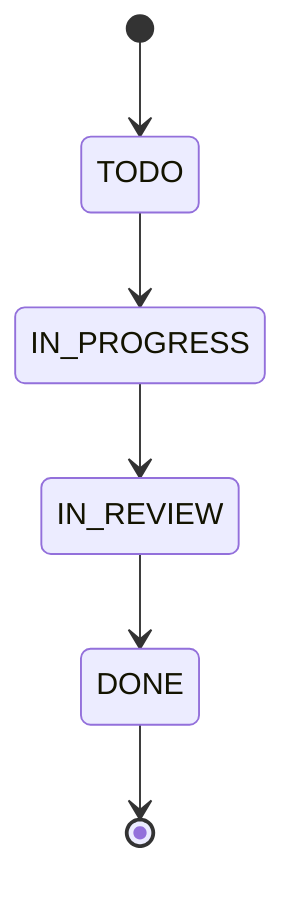
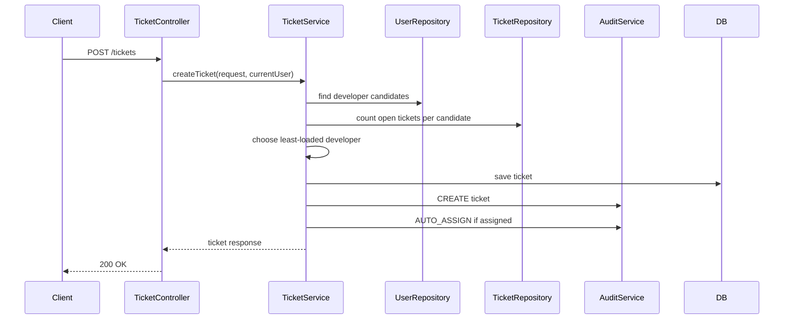
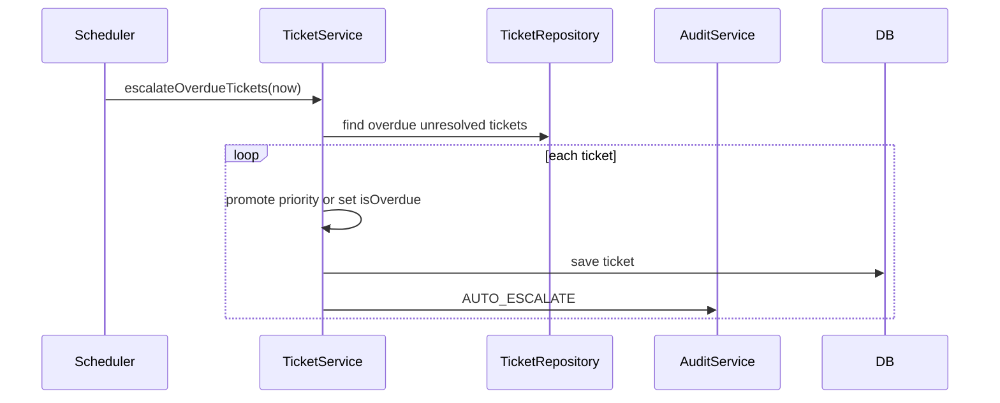
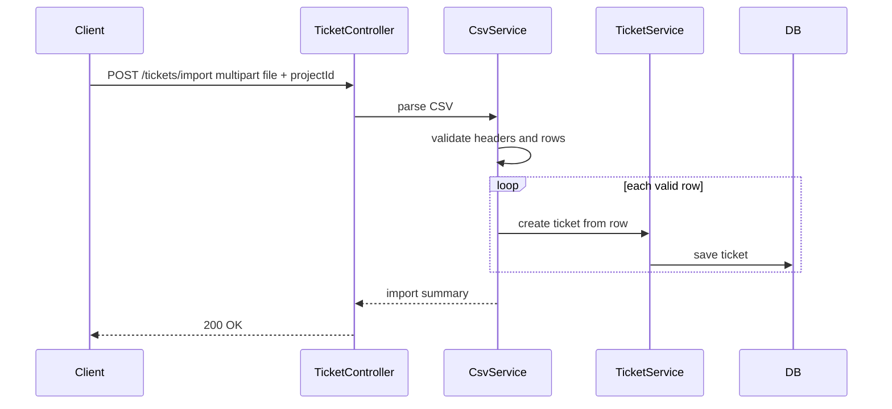
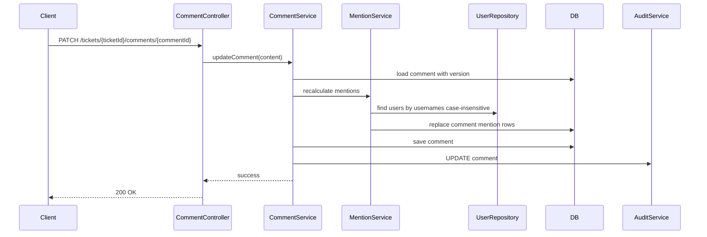

# IssueFlow Design

## 1. Assignment Understanding Summary

IssueFlow is a RESTful backend for managing users, projects, tickets, comments,
audit logs, dependencies, attachments, CSV import/export, mentions,
auto-assignment, auto-escalation, and soft delete.

The README API table is the implementation contract. The PDF adds business
rules and constraints that must be respected where they do not conflict with the
README.

Chosen stack: Java 21, Spring Boot 3.4, PostgreSQL, Spring Data JPA, JUnit, and
Mockito.

## 2. Success Criteria

- All README endpoints exist and return the documented status codes and shapes.
- All non-login endpoints are protected by JWT authentication.
- Invalid input produces clear client errors.
- Ticket lifecycle rules are enforced.
- Concurrent ticket/comment updates are rejected safely.
- Soft-deleted projects and tickets are hidden from standard reads.
- Audit logs record manual and system state changes.
- Core business rules have focused tests.
- Setup, run, test, AI usage, prompts, and design are documented.

## 3. Main Assumptions and Open Questions

Assumptions:

- The existing Java Spring Boot skeleton is the correct starting point.
- `/auth/login` is public; all other endpoints require JWT.
- User creation accepts an optional `password` field. If missing, a documented
  default password may be used for assignment/demo data.
- The public user response never exposes password hashes.
- No project membership API is defined. Auto-assignment candidates are all users
  with role `DEVELOPER`, and workload is counted inside the requested project.
- Admin-only APIs are deleted-list and restore endpoints.
- Attachments are stored in PostgreSQL as metadata plus binary content to avoid
  file-system portability problems in the assignment.
- Logout uses a simple token deny-list until token expiry, or documented
  stateless expiry if time is tight.

Open questions to document if reviewers ask:

- Whether user deletion should be hard delete or soft delete. The assignment only
  requires soft delete for projects and tickets, so users can be deleted only if
  not referenced or can be disabled internally.
- Whether attachment download is expected. README only lists upload and delete.
- Whether admins may bypass ticket/comment business rules. Recommended answer:
  no, except for restore/admin-only visibility.

## 4. Recommended Implementation Sequence

1. Documentation and project cleanup.
2. Shared error handling, validation, DTO conventions, and security foundation.
3. Users and authentication.
4. Projects and tickets.
5. Ticket lifecycle, optimistic locking, soft delete, and dependencies.
6. Comments and mentions.
7. Audit logging.
8. Auto-assignment and workload.
9. Auto-escalation scheduler.
10. Attachments and CSV import/export.
11. Full tests and final docs.

This order builds the core API first, then layers extended features on stable
domain services.

## 5. Architecture Overview

IssueFlow should be a modular monolith. Controllers handle HTTP concerns,
services own business rules, repositories own persistence, and DTOs isolate the
API contract from JPA entities.



## 6. Module/Package Structure

Recommended package layout:

```text
com.att.tdp.issueflow
  auth
  users
  projects
  tickets
  comments
  audit
  attachments
  common
```

Package responsibilities:

- `auth`: JWT login, logout, current-user lookup, security filter/config.
- `users`: user entity, role validation, user CRUD, mention lookup entrypoint.
- `projects`: project CRUD, restore, workload endpoint.
- `tickets`: tickets, lifecycle rules, dependencies, CSV import/export,
  auto-assignment, auto-escalation.
- `comments`: comments and mention recalculation.
- `audit`: append-only audit records and query endpoint.
- `attachments`: upload validation, storage, delete.
- `common`: exceptions, error response DTO, clock abstraction if needed,
  validation helpers.

## 7. Core Domain Model

Core entities:

- `User`: username, email, fullName, role, passwordHash, createdAt.
- `Project`: name, description, owner, deletedAt. The public API exposes the
  owner as `ownerId`, exactly as the README requires.
- `Ticket`: title, description, status, priority, type, project, assignee,
  dueDate, isOverdue, deletedAt, version. The public API exposes `projectId`
  and `assigneeId`.
- `Comment`: ticket, author, content, deletedAt or hard delete, version.
- `CommentMention`: comment and mentioned user.
- `TicketDependency`: blocked ticket and blocker ticket.
- `Attachment`: ticket, filename, contentType, sizeBytes, binary content.
- `AuditLog`: action, entityType, entityId, performedBy, actor, timestamp.

Enums:

- `Role`: `ADMIN`, `DEVELOPER`.
- `TicketStatus`: `TODO`, `IN_PROGRESS`, `IN_REVIEW`, `DONE`.
- `TicketPriority`: `LOW`, `MEDIUM`, `HIGH`, `CRITICAL`.
- `TicketType`: `BUG`, `FEATURE`, `TECHNICAL`.
- `AuditActor`: `USER`, `SYSTEM`.

JPA relationship note:

- In entities, prefer object relationships such as `Project.owner`,
  `Ticket.project`, `Ticket.assignee`, `Comment.ticket`, and
  `Comment.author`.
- In request/response DTOs, expose scalar IDs such as `ownerId`, `projectId`,
  `assigneeId`, `ticketId`, and `authorId` because that is the README contract.
- Do not keep duplicate writable fields like both `Ticket.project` and
  `Ticket.projectId` in the JPA entity unless one is read-only; duplicated
  writable mappings are a common source of persistence bugs.



## 8. Database/Entity Relationships



## 9. API Design Notes

- Keep endpoint paths and response shapes aligned with README.
- Return DTOs, not entities.
- Use `200 OK` where README says `200 OK`, even for create operations.
- Standard validation errors should return `400 Bad Request`.
- Missing resources should return `404 Not Found`.
- Auth failures should return `401 Unauthorized`.
- Admin-only failures should return `403 Forbidden`.
- Optimistic locking conflicts should return `409 Conflict`.
- Use ISO-8601 datetime strings for `dueDate` and timestamps.

## 10. Authentication and Authorization Design

- Add Spring Security and JWT support.
- Store `passwordHash` using BCrypt.
- `POST /auth/login` validates username and password and returns:
  `{ "accessToken": "...", "tokenType": "Bearer", "expiresIn": 3600 }`.
- JWT subject is the user id or username. Include role claim.
- `GET /auth/me` returns the current user profile.
- `POST /auth/logout` either stores the current token id in a short-lived
  deny-list or is documented as stateless logout.
- Admin-only endpoints:
  - `GET /tickets/deleted`
  - `POST /tickets/{ticketId}/restore`
  - `GET /projects/deleted`
  - `POST /projects/{projectId}/restore`

## 11. Concurrency Strategy for Ticket/Comment Updates

- Add `@Version` to `Ticket` and `Comment`.
- Let JPA detect stale writes through optimistic locking.
- Convert optimistic lock exceptions to `409 Conflict`.
- Keep update methods transactional.
- Do not use database pessimistic locks unless a specific race is proven.



Ticket update rules:

- Status can only move forward.
- DONE tickets cannot be updated.
- A ticket cannot move to DONE while unresolved blockers exist.

## 12. Audit Log Strategy

- Audit logs are append-only.
- Services explicitly write audit records after successful state changes.
- Manual user actions use `actor = USER` and `performedBy = currentUserId`.
- Scheduler and auto-assignment actions use `actor = SYSTEM`.
- Log enough to show what changed, but keep the public response aligned with
  README.
- The audit endpoint supports filters: `entityType`, `entityId`, `action`,
  `actor`.

## 13. Auto-Assignment Strategy

- Trigger only on ticket creation when `assigneeId` is absent.
- Candidate users are all `DEVELOPER` users.
- Workload is count of non-DONE, non-deleted tickets assigned to that user in the
  same project.
- Choose the user with the lowest workload.
- Break ties by oldest user registration.
- If no developers exist, create the ticket unassigned.
- Record `AUTO_ASSIGN` in the audit log when an assignment happens.



## 14. Auto-Escalation Strategy

- A scheduled job scans unresolved, non-deleted tickets with `dueDate` before
  now.
- If priority is below CRITICAL, promote one level per scheduler run.
- If priority is CRITICAL and still overdue, set `isOverdue = true`.
- Manual priority changes clear `isOverdue`; the next scheduler run re-evaluates.
- Escalation never changes ticket status.
- Each system change is audited.



## 15. CSV Import/Export Strategy

- Use Apache Commons CSV, already present in `pom.xml`.
- Export fields exactly as README lists:
  `id,title,description,status,priority,type,assigneeId`.
- Import accepts multipart file plus `projectId`.
- CSV parser must correctly handle commas and quotes.
- Validate every row independently.
- Return `{ "created": n, "failed": n, "errors": [...] }`.
- Failed rows should not prevent valid rows from being imported unless the file
  is unreadable.



## 16. Attachment Handling Strategy

- Accept uploads only on `POST /tickets/{ticketId}/attachments`.
- Enforce maximum size of 10 MB with Spring multipart config and service checks.
- Allowed content types:
  - `image/png`
  - `image/jpeg`
  - `application/pdf`
  - `text/plain`
- Store filename, content type, size, ticket id, and binary content in PostgreSQL.
- Deleting an attachment removes the attachment row.
- Audit upload and delete actions.

## 17. Mention Mechanism Strategy

- Parse mentions from comment content using a simple pattern for `@username`.
- Match usernames case-insensitively.
- On comment create, validate mentioned users and persist associations.
- On comment update, delete old associations for that comment and insert the new
  resolved mention set.
- Include `mentionedUsers` in comment responses.
- `GET /users/{userId}/mentions` returns newest comments mentioning that user.



## 18. Soft Delete Strategy

- Projects and tickets use `deletedAt`.
- Standard list/get APIs filter out rows where `deletedAt` is not null.
- Delete endpoints set `deletedAt` instead of removing rows.
- Restore endpoints clear `deletedAt`.
- Deleted-list and restore endpoints are ADMIN only.
- Comments may be hard-deleted unless later required otherwise; the assignment
  only requires soft delete for projects and tickets.

## 19. Testing Strategy

Service tests:

- Ticket status moves only forward.
- DONE tickets reject updates.
- Tickets blocked by unresolved dependencies cannot move to DONE.
- Auto-assignment picks the least-loaded developer and tie-breaks by oldest user.
- Escalation promotes by one level and sets `isOverdue` only at CRITICAL.
- Manual priority update clears `isOverdue`.
- Comment mentions are parsed, persisted, and recalculated.
- CSV parser handles commas and quotes.
- Attachment validation rejects large or unsupported files.

Controller/integration tests:

- `/auth/login` returns a JWT for valid credentials.
- Protected endpoints reject missing/invalid JWT.
- Admin-only restore/deleted endpoints reject non-admin users.
- Standard project/ticket reads hide soft-deleted records.
- Import/export endpoints match expected payload behavior.
- Optimistic locking conflict returns `409 Conflict`.

## 20. PDF Coverage Audit

After re-reading the PDF, the design covers these required items:

- Users: username, email, full name, role, CRUD, role validation.
- Authentication: JWT login, logout, current user endpoint, protected APIs.
- Projects: name, description, owner user, CRUD.
- Tickets: title, description, status, priority, type, project, optional
  assignee, due date, CRUD, project filtering, lifecycle validation, no updates
  after DONE, and optimistic locking.
- Comments: content, author, ticket, list/create/update/delete, optimistic
  locking, and mention metadata.
- Extended features: audit logs, dependencies, attachments, CSV import/export,
  soft delete for projects/tickets, mentions, auto-escalation, auto-assignment,
  validation, error handling, PostgreSQL persistence, tests, run docs, and AI
  prompt documentation.

Known ambiguity:

- The PDF says auto-assignment uses developers "linked to the project", but no
  project membership API exists in the README contract. The practical home
  assignment choice is to treat all `DEVELOPER` users as eligible and count
  their open tickets within the target project. This should be documented in
  `run.md`/README so reviewers understand the tradeoff.

## 21. Mermaid Diagrams

The required Mermaid diagrams are included above:

- System architecture diagram: section 5.
- Entity relationship diagram: section 8.
- Class/domain diagram: section 7.
- Ticket lifecycle state diagram: section 11.
- Ticket creation sequence diagram: section 13.
- Comment update and mention recalculation sequence diagram: section 17.
- Auto-escalation sequence diagram: section 14.
- CSV import sequence diagram: section 15.

## Recommended Repo Documentation Plan

- `Instructions.md`: AI/project working rules.
- `status.md`: implementation progress checklist.
- `prompts.md`: important AI prompts, model used, and how AI helped.
- `run.md`: setup, build, run, and test instructions.
- `testing.md` or README section: test strategy and command summary.

Recommended `prompts.md` entries:

- Initial assignment prompt.
- Design/planning prompt.
- Any prompts that generate or review major code sections.
- Model used: Codex based on GPT-5.

Recommended `run.md` sections:

- Prerequisites: Java 21, Docker, Maven wrapper.
- Start PostgreSQL: `docker compose up -d`.
- Run app: `./mvnw spring-boot:run`.
- Run tests: `./mvnw test`.
- Example login and JWT usage.
